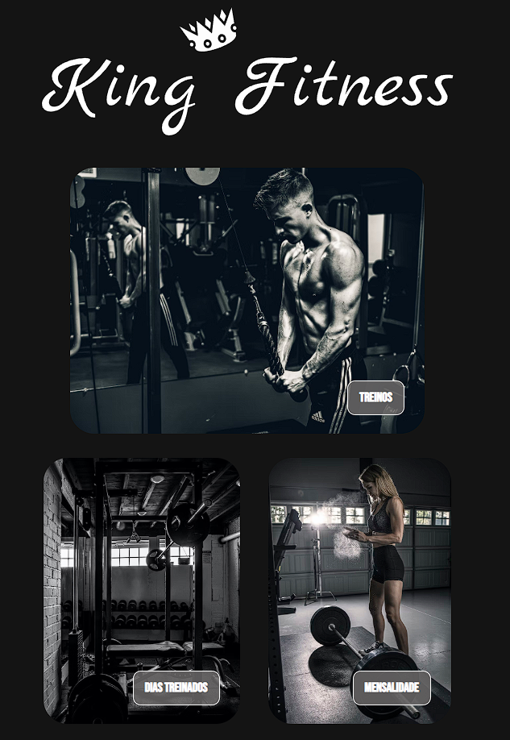

<h1 align="center"> King Fitness </h1>

 A simple project designed for fun and to test my knowledge. 

## 📖 Index

  <a href="#-technologies">Technologies</a>&nbsp;&nbsp;&nbsp;|&nbsp;&nbsp;&nbsp;
  <a href="#-project">Project</a>&nbsp;&nbsp;&nbsp;|&nbsp;&nbsp;&nbsp;
  <a href="#-demonstration">Demonstration</a>&nbsp;&nbsp;&nbsp;|&nbsp;&nbsp;&nbsp;
  <a href="#memo-license">License</a>

  

 

## 📷 Demonstration

  

## 🚀 Technologies

This project was developed with the following technologies;

- HTML and CSS.

## 💻 Project

King Fitness is a simple gym-related project.

## :memo: License

This project is lincensed under [MIT](https://choosealicense.com/licenses/mit/) .

---
